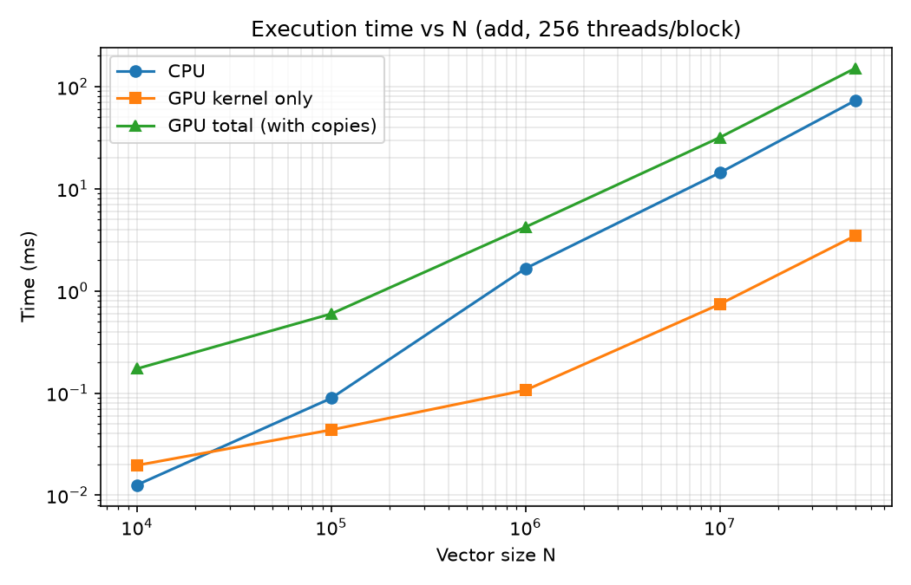
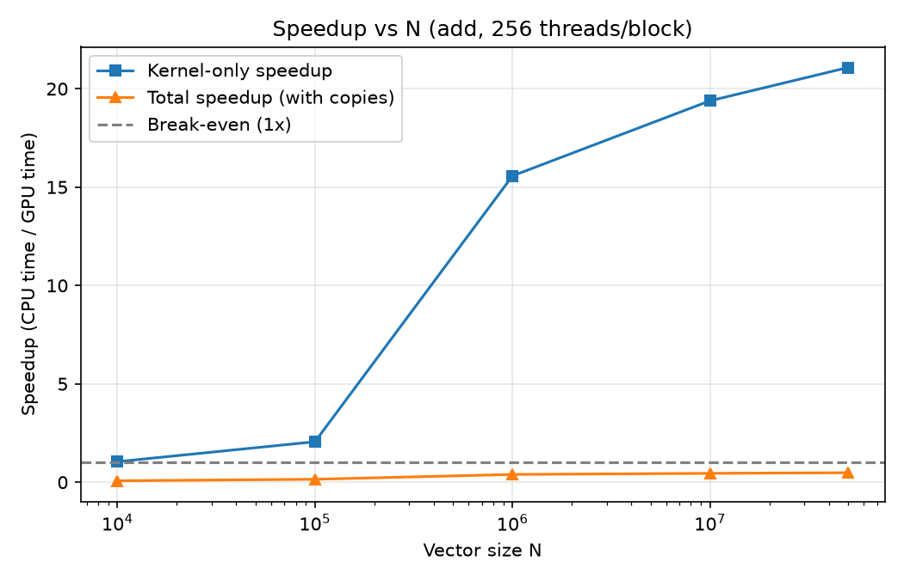
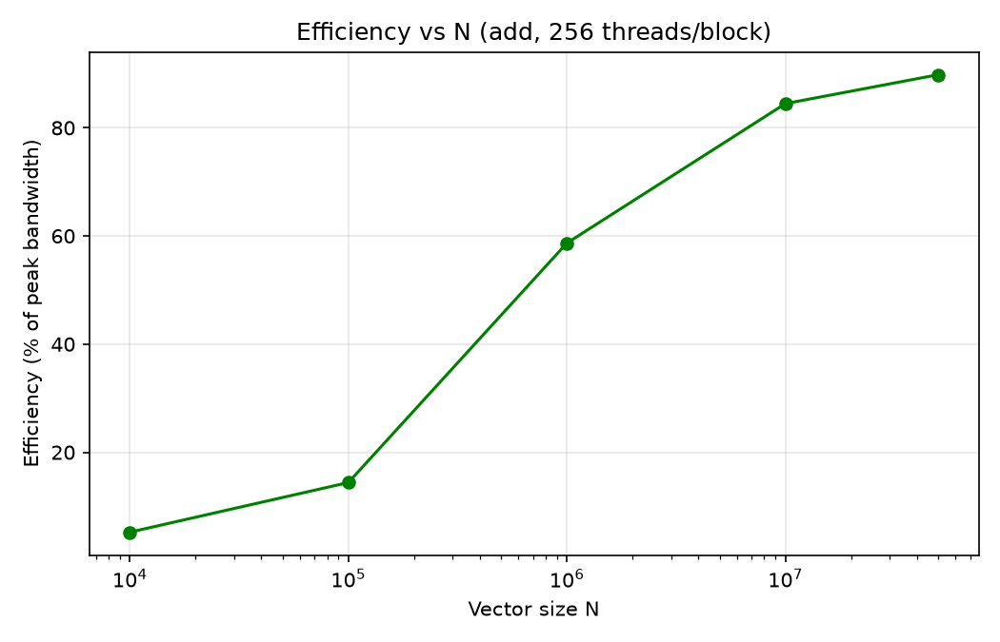
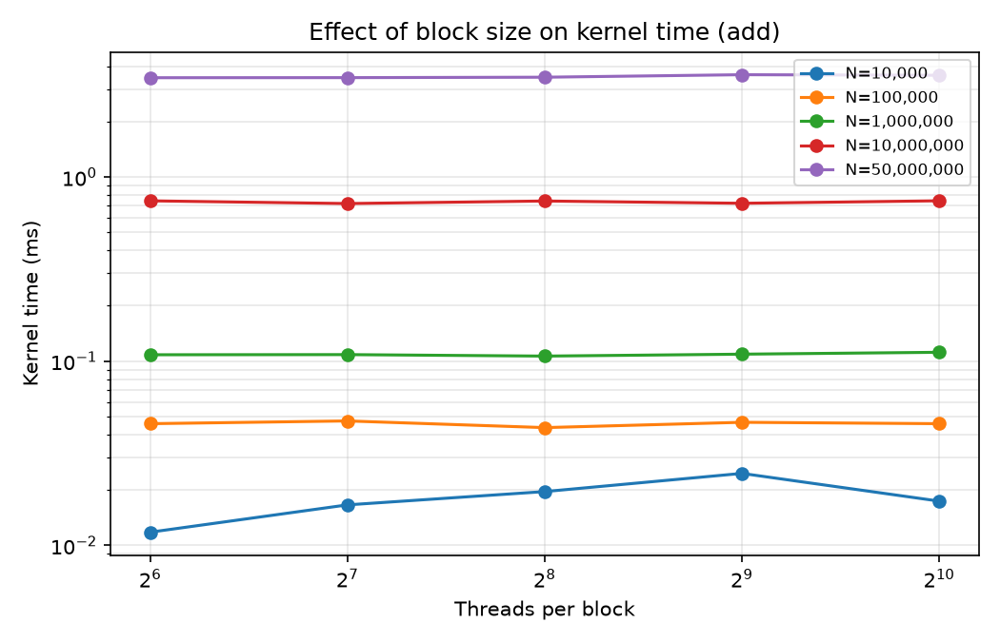

<h1 align="center">GPU Vector Operations using CUDA</h1>

<p align="center">
  Vector addition and element-wise multiplication on the GPU, benchmarked against a sequential CPU baseline.
</p>

<p align="center">
  
  
  
  
</p>

**Author:** Abhinandan
**Course:** Parallel Computing (Lab Evaluation), Topic 7: GPU Vector Operations (CUDA)

---

## Table of Contents

1. [Objective](#objective)
2. [Environment](#environment)
3. [Method](#method)
4. [Repository Structure](#repository-structure)
5. [Build and Run](#build-and-run)
6. [Results](#results)
7. [Graphs](#graphs)
8. [Key Findings](#key-findings)
9. [Limitations](#limitations)

---

## Objective

Implement vector addition and element-wise multiplication using CUDA threads, and compare execution time against a sequential CPU implementation across different vector sizes and block sizes.

## Environment

| Component | Details |
|---|---|
| GPU | NVIDIA GeForce GTX 1650 Ti (Laptop), 4 GB |
| Driver | 617.42 |
| CUDA Toolkit | 13.4 |
| Compiler | nvcc with Visual Studio 2026 (MSVC) |
| OS | Windows 11 |
| Analysis | Python 3.13, pandas, matplotlib |

## Method

- **Sequential baseline:** a single CPU loop computing `c[i] = a[i] + b[i]` (or `a[i] * b[i]`).
- **Parallel version:** one CUDA thread per element, with a bounds check and `blocks = (N + threads - 1) / threads`.
- **Timing:** `std::chrono` for the CPU and `cudaEvent` for the GPU. Two GPU times are recorded:
  - *Kernel only*: the kernel execution.
  - *Total*: host-to-device copy + kernel + device-to-host copy.
- **Warm-up:** one untimed kernel launch before measuring, to exclude CUDA initialisation cost.
- **Correctness:** every GPU result is compared element by element with the CPU result.
- **Experiments:** N = 10⁴, 10⁵, 10⁶, 10⁷, 5×10⁷; block sizes 64, 128, 256, 512, 1024; both operations; 5 repeats per setting (250 runs total), averaged.
- **Efficiency:** achieved memory bandwidth ÷ assumed peak bandwidth (≈ 192 GB/s), where achieved bandwidth = 3 × N × 4 bytes ÷ kernel time.

## Repository Structure

```
lab-evaluation-cuda-vector-ops/
├── README.md
├── src/
│   ├── vec_gpu.cu           CUDA program (CPU baseline + GPU kernels + timing)
│   ├── run_experiments.py   runs all 250 experiments, writes results.csv
│   ├── make_graphs.py       averages repeats, produces graphs and summary
│   └── check.py             sanity check on results.csv
├── results/
│   ├── results.csv          raw timings (250 rows)
│   ├── averaged.csv         averages over the 5 repeats
│   └── summary.csv          table at 256 threads per block
└── graphs/                  execution time, speedup, efficiency, block-size plots
```

## Build and Run

Open **x64 Native Tools Command Prompt for VS**, go to the project root, then:

```
nvcc -O2 src\vec_gpu.cu -o vec_gpu.exe
vec_gpu.exe 1000000 256 0
python src\run_experiments.py
python src\make_graphs.py
```

`vec_gpu.exe` takes three arguments: vector size `N`, threads per block, and operation (`0` = add, `1` = multiply). Run all commands from the project root.

## Results

Averages of 5 runs at 256 threads per block. Kernel speedup = CPU time ÷ GPU kernel time; total speedup = CPU time ÷ GPU total time.

### Vector addition

| N | CPU (ms) | GPU kernel (ms) | GPU total (ms) | Kernel speedup | Total speedup | Efficiency |
|---:|---:|---:|---:|---:|---:|---:|
| 10⁴ | 0.013 | 0.020 | 0.173 | 1.05× | 0.07× | 5.2% |
| 10⁵ | 0.089 | 0.044 | 0.597 | 2.06× | 0.15× | 14.4% |
| 10⁶ | 1.659 | 0.107 | 4.217 | 15.6× | 0.40× | 58.7% |
| 10⁷ | 14.346 | 0.741 | 31.801 | 19.4× | 0.45× | 84.5% |
| 5×10⁷ | 73.356 | 3.481 | 151.965 | 21.1× | 0.48× | 89.8% |

### Vector multiplication

| N | CPU (ms) | GPU kernel (ms) | GPU total (ms) | Kernel speedup | Total speedup | Efficiency |
|---:|---:|---:|---:|---:|---:|---:|
| 10⁴ | 0.013 | 0.040 | 0.190 | 0.38× | 0.07× | 1.8% |
| 10⁵ | 0.081 | 0.049 | 0.579 | 1.65× | 0.14× | 12.7% |
| 10⁶ | 1.583 | 0.114 | 3.419 | 13.9× | 0.46× | 54.8% |
| 10⁷ | 13.603 | 0.744 | 29.659 | 18.3× | 0.46× | 84.1% |
| 5×10⁷ | 68.233 | 3.480 | 151.333 | 19.6× | 0.45× | 89.8% |

GPU and CPU results matched exactly in all 250 runs (0 errors).

## Graphs

<table>
  <tr>
    <td align="center"><b>Execution time vs N (add)</b><br></td>
    <td align="center"><b>Speedup vs N (add)</b><br></td>
  </tr>
  <tr>
    <td align="center"><b>Efficiency vs N (add)</b><br></td>
    <td align="center"><b>Block size vs kernel time (add)</b><br></td>
  </tr>
</table>

Plots for multiplication are in the [`graphs/`](graphs) folder.

## Key Findings

- **The GPU kernel is up to about 21× faster** than the sequential CPU loop at large N.
- **End to end, the GPU is slower** (total speedup below 1×). Vector add and multiply do very little work per byte, so PCIe transfer time outweighs the gain.
- **Small vectors don't benefit.** At N = 10⁴, launch overhead dominates and the kernel is no faster than the CPU.
- **Efficiency reaches about 90% of peak memory bandwidth** at large N, so the kernels are memory-bound.
- **Block size has almost no effect** (64 to 1024 threads), which is expected for memory-bound kernels.
- **The GPU would pay off overall** if data stayed on the device across many operations, or if each element needed heavier computation.

## Limitations

- Measurements at N = 10⁴ and 10⁵ are noisy because the kernels run for only microseconds.
- The efficiency figure assumes a peak bandwidth of about 192 GB/s; the exact value should be checked against the GPU's specification.
- Results come from a single laptop GPU running Windows with background applications.
